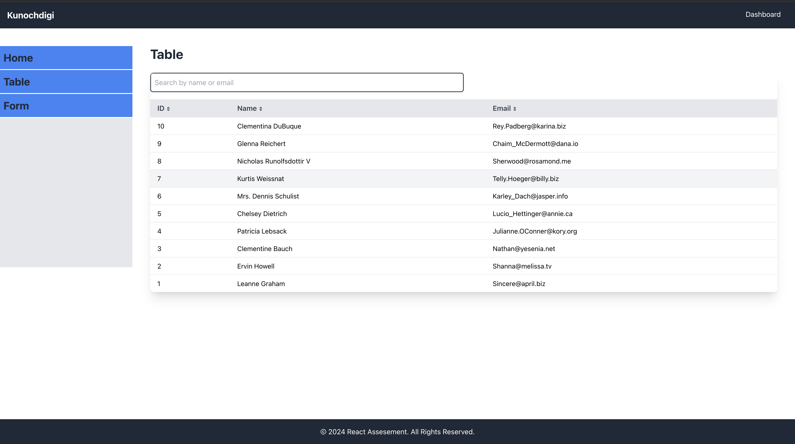

<h1>Kunochdigi Task</h1>
<h6><i> 
Create a dashboard component that fetches and displays API data in a filterable and sortable table.

 Design a form with React Context for form state and validation.</i></h6>

# Prototype

# Technologies 

 + [ReactJs](https://react.dev/learn/installation)
 + [TailwindCss](https://tailwindcss.com/) 
 + [Javascript](https://www.javascriptlang.org/) 
 + [createContext](https://react.dev/reference/react/createContext/)
 + [Github Actions](https://docs.github.com/en/actions/)

# How to Test run
 <h3>How to Test the Form</h3>

    <bold>Used React Context for form state and validation</bold>

   1.  Name: Leave it empty → "Name is required".

   2.  Email: Leave it empty → "Email is required".
   3.  Invalid Email: Use an incorrect email like user@domain → "Please enter a valid email address".
   4.  Uncommon Domain: Use a non-common email domain (e.g., user@weird.com) → "The email domain is suspicious or uncommon".
   5.  Valid Email: Use a valid email like user@gmail.com → The form will submit, and a success modal will appear.

 <h3>How to text the Table</h3>

   1.  The table displays data with sortable columns for Name and Email.
  2.   Use the Search input at the top to search by name or email. The table will filter results based on the search term.
  3.   Try searching by a full or partial name or email (e.g., john, gmail, doe).
  4.   Click on the column headers to sort the data in ascending or descending order. Sorting will toggle between ascending and descending by clicking the header.

 
# How to Contribute

1. Clone the repository
 `git clone https://github.com/itsadaeze/-kunochdigi.git`

2. Change directory into the `cloned folder ` and run the setup script 
 `cd  -kunochdigi`

3. Open your terminal and type this command `npm install ` to add the react dependency to the app in the development mode.

4. After the Successful installation of the  dependency type/copy this command  `npm start` to run the app in your local environment 

5. Copy this link  [http://localhost:3000/](http://localhost:3000/) and paste it to your web browser(Chrome, safari, mozilla firefox et.c) to view it.

# Deployment
Vercel was used to deploy the app. 
 + [Vercel](https://kunochdigi.vercel.app)

# License
The MIT License - Copyright (c) 2024 - Present, itsadaeze 

# Author
Ugwu Adaeze (Software Developer)